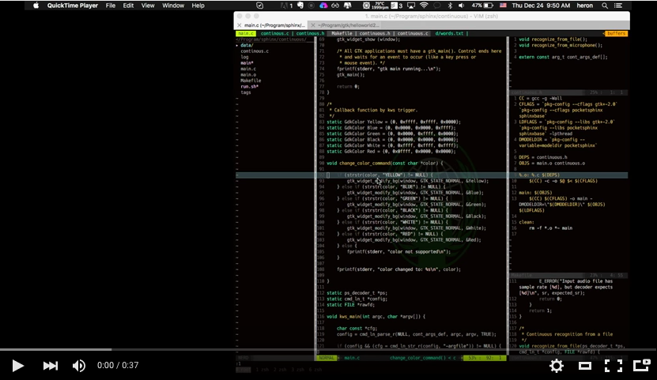

# Keyword Spotting for Controlling Window Background Color

## Introduction

This is a small testing program that uses both CMUSphinx and GTK+ to demonstrate keyword spotting (KWS) algorithm.

## Components

In ```main.c```, the program fires up a thread for handling GUI jobs right after it started. Then, it started to setup pocketsphinx and call ```recognize_from_microphone``` or ```recognize_from_file``` for the audio input. Since argc/argv is passed into the settings, the user can specify the dictionary file or log file as what is written in ```run.sh```.

## Compile

```bash
> make
```

## Run

```bash
> ./run.sh
```

## Demo
[](https://www.youtube.com/watch?v=kEonDr93Ecc)
